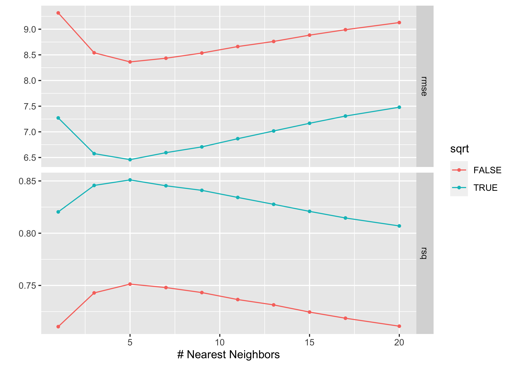

<!-- README.md is generated from README.Rmd. Please edit that file -->

# maybestep

<!-- badges: start -->
<!-- badges: end -->

maybestep is a [recipes](https://recipes.tidymodels.org) extension
provinding `step_maybe` that allows users to easily tune the presence of
a step in a tidymodels workflow.

## Installation

~~You can install the released version of maybestep from
[CRAN](https://CRAN.R-project.org) with:~~

``` r
install.packages("maybestep")
```

To install the development version from GitHub use:

``` r
remotes::install_github("dfalbel/maybestep")
```

## Example

Sometimes it’s interesting to compare the same model but using different
preprocessign steps. The recipes package is a great tool for that end,
providing a nice API to test different hyperparameters in the
preprocessing stage however, it doesn’t easily allow one to compare
models with or without a preprocessing step.

In the example below we will compare a KNN algorithm using normalized
and unnormalized predictors.

``` r
library(maybestep)
library(tidymodels)
set.seed(1)

data(concrete)

model <- nearest_neighbor(neighbors = tune()) %>%
  set_engine("kknn") %>%
  set_mode("regression")

rec <- recipe(compressive_strength ~ ., data = concrete) %>%
    step_maybe(step_sqrt, all_numeric_predictors(), use = tune("sqrt"))

wflow <- workflow() %>% 
  add_recipe(rec) %>% 
  add_model(model)

grid <- grid_regular(
  sqrt = use_step(),
  neighbors(c(1, 20)),
  levels = 10
)

res <- tune_grid(
  wflow,
  resamples = vfold_cv(concrete, v = 5),
  grid = grid
)

autoplot(res)
```



We can see that taking the square root of the numeric predictors had a
strong effect in the model results.
